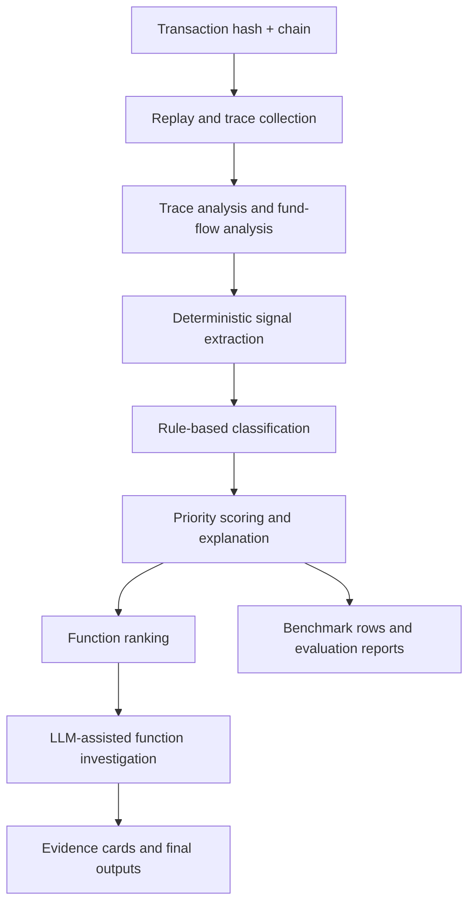

# FaultSeeker++

<p align="center">
  
</p>

<p align="center">
  <strong>AI-assisted blockchain transaction forensics and vulnerability localization</strong>
</p>

<p align="center">
  Analyze exploit transactions, reconstruct execution traces, extract deterministic security signals,
  rank suspicious functions, and generate benchmark-ready forensic outputs.
</p>

<p align="center">
  
  
  
  
  
</p>

## Overview

FaultSeeker++ is a research-oriented framework for smart contract exploit analysis.
It combines transaction replay, trace inspection, fund-flow analysis, deterministic signal extraction,
rule-based classification, and LLM-assisted function investigation in one pipeline.

The project is designed for two workflows:

1. Single-transaction forensics for understanding a specific exploit.
2. Benchmark and evaluation runs for measuring signal quality, ranking behavior, and cross-chain coverage.

## Why FaultSeeker++

FaultSeeker++ is built to close practical gaps in earlier fault-localization tooling:

- Hybrid local/cloud model routing to reduce unnecessary API spend.
- Human-in-the-loop checkpoints for analyst-guided review.
- Structured explainability through evidence cards and signal breakdowns.
- Confidence scoring and priority ranking for function triage.
- Multi-chain benchmark coverage across real exploit transactions.
- Dataset and evaluation export paths for reproducible experiments.

## What It Produces

At the transaction level, FaultSeeker++ now emits structured forensic outputs instead of only raw heuristics.
That includes calibrated reentrancy analysis, explainable signals, and bounded ranking components.

```python
{
    "reentrancy": {
        "score": 0.675,
        "detected": True,
        "tier": "POSSIBLE_REENTRANCY",
        "signals": {
            "cross_function_reentry": True,
            "reentry_before_return": True,
            "state_slot_reentry": False
        },
        "context": {
            "fallback_mode": True,
            "storage_trace_available": False
        }
    },
    "priority": {
        "total": 0.8754,
        "exploitability": 0.75,
        "reentrancy": 0.459,
        "flashloan": 0.0,
        "price_manipulation": 0.0,
        "liquidity_drain": 0.081,
        "reentrancy_source": "fallback"
    }
}
```

This makes the system useful not just for detection, but also for:

- analyst-facing triage
- benchmark scoring
- dataset generation
- ranking experiments
- downstream model training

## Core Capabilities

- Transaction replay and trace recovery with Foundry and trace-capable RPC providers.
- Deterministic signal extraction before any LLM reasoning.
- State-first reentrancy detection with fallback logic for public RPC environments.
- Proxy-safe delegatecall handling and cross-function reentrancy support.
- Function ranking and multi-agent function analysis.
- Evidence-card generation and confidence scoring.
- Benchmark evaluation, CSV export, and publication chart generation.

## Architecture



High-level pipeline layers:

- Data collection: transaction replay, trace parsing, chain metadata, contract download.
- Forensics: trace analysis, address classification, deterministic signals, rule classification.
- Function analysis: suspicious-function ranking, task decomposition, LLM investigation.
- Evaluation: benchmark harnesses, CSV export, charts, cross-chain reports.

## Repository Layout

```text
faultseeker/
  core/                 pipeline orchestration, routing, confidence scoring
  data_collection/      replay, trace parsing, transaction metadata, contract download
  forensics/            signal extraction, classification, forensic result schemas
  function_analysis/    function ranking and multi-agent investigation
  prompts/              model prompts and task templates
  utils/                RPC, explorer, parser, and agent utilities

benchmark/              benchmark CSV, validation, signal evaluation harness
tests/                  regression and integration tests
paper/                  implementation paper skeleton
reports/                generated evaluation outputs
data/output/            single-run analysis artifacts
```

## Requirements

- Python 3.10 or newer
- `pip`
- Foundry `cast` available on `PATH` for the most reliable replay path
- At least one configured cloud LLM key for full analysis flows
- Trace-capable archive RPC access for production-quality replay

Install dependencies:

```bash
pip install -r requirements.txt
```

## Configuration

Copy the template and fill in only what you actually need:

```bash
cp .env.example .env
```

Recommended minimum setup:

- one cloud LLM key
- one trace-capable RPC for the target chain
- explorer API keys if you want verified source download

Common environment variables:

```env
# LLM providers
OPENAI_API_KEY=
GOOGLE_API_KEY=
DASHSCOPE_API_KEY=
XAI_API_KEY=
ANTHROPIC_API_KEY=

# Explorer APIs
ETHERSCAN_API_KEY=
BSCSCAN_API_KEY=
ARBISCAN_API_KEY=
OPTIMISM_API_KEY=
BASESCAN_API_KEY=
POLYGONSCAN_API_KEY=
SNOWTRACE_API_KEY=
ZKSYNC_API_KEY=

# Trace-capable RPCs
TENDERLY_ACCESS_KEY=
ETH_RPC_URL=
BSC_RPC_URL=
ARBITRUM_RPC_URL=
OPTIMISM_RPC_URL=
BASE_RPC_URL=
POLYGON_RPC_URL=
AVALANCHE_RPC_URL=
ZKSYNC_RPC_URL=
```

Important RPC note:

- `debug_traceTransaction` is not available on many free public RPC endpoints.
- For Ethereum, Tenderly is the easiest path for reliable trace access.
- Ankr-based RPCs are used throughout the project templates.
- Foundry replay remains useful when RPC trace methods are restricted.

## Quick Start

Analyze a single transaction:

```bash
python -m faultseeker -txn_hash 0xYOUR_TX_HASH -chain eth
```

Show explainability output:

```bash
python -m faultseeker -txn_hash 0xYOUR_TX_HASH -chain eth --explain
```

Use a transaction explorer link instead of hash + chain:

```bash
python -m faultseeker -txn_link https://etherscan.io/tx/0xYOUR_TX_HASH
```

Windows helper:

```powershell
.\run_faultseeker_auto.bat
```

## Benchmark and Evaluation

There are two distinct evaluation paths in the repository.

### 1. End-to-End Benchmark Runner

This is the high-level benchmark script used for sampled or full evaluation runs:

```bash
python run_benchmark_eval.py --limit 5
python run_benchmark_eval.py --chains eth arbitrum base --limit 10
python run_benchmark_eval.py --full
```

Outputs are written to `reports/eval/`:

- `eval_results_*.json`
- `eval_results_*.csv`
- `eval_summary_*.txt`

### 2. Signal-Focused Evaluation Harness

This runner is useful when you want to inspect deterministic signal quality directly:

```bash
python benchmark/run_eval.py --chain eth --limit 20 --save
python benchmark/run_eval.py --signals-only --limit 50
```

Outputs are written to `benchmark/eval_results/`.

## Benchmark Dataset

The benchmark dataset is centered on real exploit transactions and currently covers eight benchmark chains:

- Ethereum
- BSC
- Arbitrum
- Optimism
- Base
- Polygon
- Avalanche
- zkSync

Headline dataset stats from the repository:

- 246 exploit transactions
- 2021 to 2026 coverage
- 80+ vulnerability labels and variants
- sources spanning postmortems, incident writeups, and exploit repositories

Validate the benchmark CSV:

```bash
python benchmark/validate_dataset.py
```

## Reentrancy Forensics

One of the stronger parts of the current pipeline is the reentrancy engine.
It no longer relies only on repeated addresses or repeated selectors.

Implemented behavior includes:

- storage-backed slot mutation detection
- write-after-external-call checks
- fallback structural detection when storage traces are unavailable
- proxy-safe delegatecall normalization
- cross-function reentrancy support
- fallback/source-aware scoring and ranking
- explainable `signals`, `context`, `tier`, and `priority` outputs

This makes the reentrancy path useful in both:

- rich tracing environments with opcode or storage data
- restricted public-RPC environments where only call structure is available

## Charts and Reports

Generate publication-oriented charts:

```bash
python generate_charts.py
```

Cross-chain comparative analysis:

```bash
python -m faultseeker.core.cross_chain_runner --limit 5 --chains eth bsc arbitrum
```

## Supported Model Providers

The repository is designed around a hybrid routing model.
Simple tasks can stay local while heavier reasoning can escalate to a cloud model.

Configured providers include:

- Ollama
- OpenAI
- Google Gemini
- Alibaba Qwen via DashScope
- xAI Grok
- Anthropic

## Practical Notes

- This is a research prototype, not a turnkey production monitoring service.
- Trace quality depends heavily on RPC capability.
- Free public nodes are often not sufficient for deep replay.
- Some scripts are benchmark-oriented and some are analysis-oriented; use the right one for your workflow.
- The benchmark chain set and the general utility layer are related but not identical in every module, so treat the benchmark scripts as the source of truth for evaluation coverage.

## Development

Run the regression suite:

```bash
python -m pytest tests -q
```

Targeted examples:

```bash
python -m pytest tests/test_reentrancy_state_signals.py -q
python -m pytest tests/test_reentrancy_eval_integration.py -q
python -m pytest tests/test_pipeline_parse.py -q
```

## Citation

If you use FaultSeeker++ in research, cite the accompanying implementation work once authorship and venue details are finalized:

```bibtex
@article{faultseekerpp2026,
  title   = {FaultSeeker++: Enhancing AI-Powered Blockchain Transaction Fault Localization},
  author  = {[Authors]},
  journal = {[Venue]},
  year    = {2026}
}
```

## License

This project is released under the MIT License. See [LICENSE](LICENSE).
