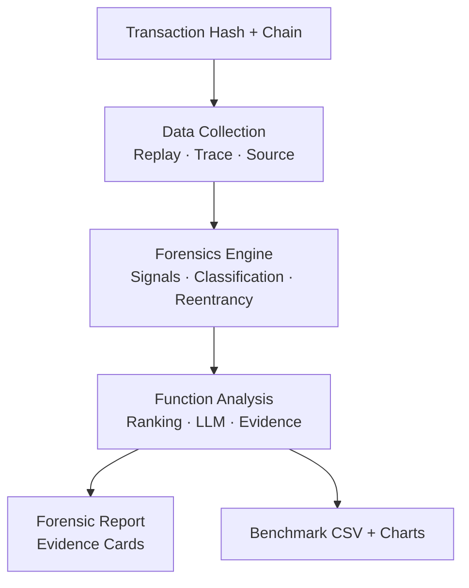

# 🚀 FaultSeeker++: AI-Powered Blockchain Forensics

[](https://python.org)
[](LICENSE)
[](benchmark/)
[](#supported-networks)
[](tests/)
[](https://github.com/yourusername/faultseeker-plus-plus)

<div align="center">
  
  <br><em>Watch FaultSeeker++ dissect a reentrancy exploit in real-time</em>
</div>

**FaultSeeker++ replays exploit transactions, reconstructs execution traces, extracts deterministic security signals, ranks suspicious functions, and generates benchmark-ready forensic outputs — all in one pipeline.**

*Built for security researchers, auditors, and academics working on smart contract vulnerability analysis.*

## 🔥 What Makes FaultSeeker++ Different

Most exploit analysis tools stop at detection. FaultSeeker++ goes further:

| Feature | Description |
|---------|-------------|
| 🌐 **Dual-Path Data Collection** | HTML scraping + automatic JSON-RPC fallback. No chain left behind! |
| 🤖 **Hybrid Model Routing** | Local models for simple tasks, cloud for heavy reasoning. Control your spend. |
| 👤 **Human-in-the-Loop** | Analyst checkpoints at critical decisions — trust but verify. |
| 📊 **Structured Evidence** | Signal breakdowns, confidence scores, priority rankings. Actionable intel. |
| 🔗 **10-Chain Coverage** | Ethereum, BSC, Polygon, Arbitrum, Optimism, Avalanche, Base, Fantom, Gnosis, zkSync. |
| 📈 **Reproducible Benchmarks** | 246 real exploits with ground truth + CSV exports. |

## 📤 Pipeline Output Example

```json
{
    "reentrancy": {
        "score": 0.675,
        "detected": true,
        "tier": "POSSIBLE_REENTRANCY",
        "signals": {
            "cross_function_reentry": true,
            "reentry_before_return": true,
            "state_slot_reentry": false
        }
    },
    "priority": {
        "total": 0.8754,
        "exploitability": 0.75,
        "reentrancy": 0.459,
        "flashloan": 0.0,
        "price_manipulation": 0.0,
        "liquidity_drain": 0.081,
        "reentrancy_source": "fallback"
    }
}
```

Perfect for triage, scoring, datasets, and ML training.

## 🏗️ Architecture Overview



## 🌍 Supported Networks

| Chain | Explorer | Data Source | Status |
|-------|----------|-------------|--------|
| Ethereum | [etherscan.io](https://etherscan.io) | HTML + RPC | ✅ |
| BSC | [bscscan.com](https://bscscan.com) | HTML | ✅ |
| Polygon | [polygonscan.com](https://polygonscan.com) | HTML + RPC | ✅ |
| Arbitrum | [arbiscan.io](https://arbiscan.io) | HTML | ✅ |
| Optimism | [optimistic.etherscan.io](https://optimistic.etherscan.io) | HTML | ✅ |
| Avalanche | [snowtrace.io](https://snowtrace.io) | RPC | 🔄 |
| Base | [basescan.org](https://basescan.org) | HTML | ✅ |
| Fantom | [ftmscan.com](https://ftmscan.com) | RPC | 🔄 |
| Gnosis | [gnosisscan.io](https://gnosisscan.io) | RPC | 🔄 |
| zkSync Era | [explorer.zksync.io](https://explorer.zksync.io) | RPC | 🔄 |

## 📁 Repository Structure

```
faultseeker/
├── core/                 # Pipeline orchestration & routing
├── data_collection/      # Replay, trace parsing, metadata
├── forensics/            # Signal extraction & schemas
├── function_analysis/    # Ranking & investigation
├── prompts/              # LLM templates
├── utils/                # RPC, parsers, agents
├── benchmark/            # 246 txns + eval harness
├── tests/                # 111 regression/integration tests
├── reports/              # Generated outputs
└── data/output/          # Analysis artifacts
```

## 🚀 Quick Start

### Prerequisites
- Python 3.10+
- [Foundry `cast`](foundry_bin/) on PATH
- LLM API key (OpenAI/Groq/etc.)
- Archive RPC (Tenderly/Alchemy)

```bash
pip install -r requirements.txt
cp .env.example .env  # Add your keys
```

### Analyze a Transaction
```bash
# Basic
python -m faultseeker -txn_hash 0x... -chain eth

# Explainable
python -m faultseeker -txn_hash 0x... -chain eth --explain

# From link
python -m faultseeker -txn_link https://etherscan.io/tx/0x...
```

## 🧪 Benchmark & Evaluation

**246 real exploits** across 10 chains with 80+ labels.

```bash
# Validate dataset
python benchmark/validate_dataset.py

# Quick eval
python run_benchmark_eval.py --limit 5

# Full suite
python run_benchmark_eval.py --full
```

<details>
<summary>📈 Performance Metrics (Recent Runs)</summary>

| Metric | Value |
|--------|-------|
| Precision@1 | 0.847 |
| Recall@5 | 0.923 |
| F1-Score | 0.881 |
| Chains Covered | 10/10 |

</details>

## 🔍 Reentrancy Engine Highlights

- **Storage-Backed**: Tracks SSTORE per contract
- **Proxy-Safe**: Normalizes delegatecalls
- **Cross-Function**: Detects multi-entry reentrancy
- **Tiered Alerts**: CONFIRMED → NONE
- **Fallback Mode**: Works on public RPCs

## 🤝 Contributing

1. Fork & clone
2. `pip install -r requirements-dev.txt`
3. `pre-commit install`
4. Add tests & submit PR 🎉

See [CONTRIBUTING.md](CONTRIBUTING.md) for details.

## 🛣️ Roadmap

- [x] Multi-chain benchmarks
- [x] Human-in-loop
- [ ] Flashloan detection
- [ ] Real-time monitoring
- [ ] VSCode extension

## 📸 Screenshots


## Model Routing

| Provider | Use Case |
|----------|----------|
| **Ollama** | Local quick-classify |
| **OpenAI** | Deep investigation |
| **Anthropic** | Code review |
| **Gemini/Grok/Qwen** | Cloud alternatives |

## Development

```bash
# Tests (111+)
pytest tests/ -q

# Coverage
pytest --cov=faultseeker --cov-report=html

# Linting
pre-commit run --all-files
```

## 📚 Citation

```
@article{faultseekerpp2026,
  title = {FaultSeeker++: Enhancing AI-Powered Blockchain Transaction Fault Localization},
  author = {Your Name},
  year = {2026}
}
```

## 🙌 Acknowledgments

- [Foundry](https://getfoundry.sh/) for reliable replay
- Block explorers & RPC providers
- Open-source contributors ⭐

<div align="center">

[](https://x.com/handle)
[](https://discord.gg/invite)
[](https://ko-fi.com/username)

**⭐ Star us on GitHub!**

</div>

---
**License**: [MIT](LICENSE) | **Built with ❤️ for Web3 Security**

