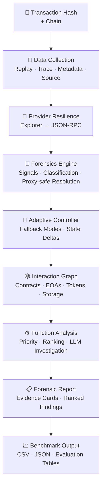

<div align="center">


# ⚡ FaultSeeker++

### AI-Powered Blockchain Transaction Forensics & Vulnerability Localization

[](https://python.org)
[](LICENSE)
[](#-supported-networks)
[](#-benchmark--evaluation)
[](#-benchmark--evaluation)
[](#-development)
[](.)

<br/>

> **FaultSeeker++** replays exploit transactions, reconstructs execution traces, extracts deterministic security signals, ranks suspicious functions, and generates benchmark-ready forensic outputs — all in a single unified pipeline.

*Built for security researchers, auditors, and academics working on smart contract vulnerability analysis.*

---

[**Quick Start**](#-getting-started) · [**Architecture**](#-architecture) · [**Networks**](#-supported-networks) · [**Benchmark**](#-benchmark--evaluation) · [**Research**](#-research-readiness) · [**Citation**](#-citation)

</div>

---

## Why FaultSeeker++?

Most exploit analysis tools stop at detection. FaultSeeker++ goes further — from raw transaction hash to a structured, ranked, and explainable forensic report.

| Capability | What it means |
|---|---|
| 🔀 **Dual-path data collection** | Explorer scraping with JSON-RPC fallback when block explorers are WAF-protected or incomplete. |
| 🧠 **Hybrid model routing** | Simple tasks stay on local models; heavier reasoning can escalate to cloud providers. |
| 🧑‍💻 **Human-in-the-loop checkpoints** | The analyst stays in the loop at critical decision points instead of blindly trusting model output. |
| 📊 **Structured evidence** | Findings include signal breakdowns, confidence scores, graph context, and priority rankings. |
| 🌐 **10-chain coverage** | Ethereum, BSC, Polygon, Arbitrum, Optimism, Avalanche, Base, Fantom, Gnosis, and zkSync. |
| 🧪 **Reproducible benchmarks** | 115 ground-truth exploit transactions (function + line targets), 241 source-validated incidents, 1,000 real-trace benign transactions collected via archive RPC, staged public imports, and validation scripts. |
| 🔬 **Research tooling** | Adaptive fallback, graph reasoning, confidence calibration, adversarial helpers, and statistical evaluation utilities. |

---

## 🏗 Architecture



---

## 📦 Pipeline Output

FaultSeeker++ emits **structured forensic data** at the transaction level, ready for analyst triage, benchmark scoring, dataset generation, and downstream model training.

```json
{
    "reentrancy": {
        "score": 0.675,
        "detected": true,
        "tier": "POSSIBLE_REENTRANCY",
        "signals": {
            "cross_function_reentry": true,
            "reentry_before_return": true,
            "state_slot_reentry": false
        }
    },
    "priority": {
        "total": 0.8754,
        "exploitability": 0.75,
        "reentrancy": 0.459,
        "flashloan": 0.0,
        "price_manipulation": 0.0,
        "liquidity_drain": 0.081,
        "reentrancy_source": "fallback"
    }
}
```

---

## 🌐 Supported Networks

| Chain | Explorer | Data Source | Status |
|---|---|---|:---:|
| **Ethereum** | etherscan.io | HTML + RPC | ✅ |
| **BSC** | bscscan.com | HTML + RPC | ✅ |
| **Polygon** | polygonscan.com | HTML + RPC | ✅ |
| **Arbitrum** | arbiscan.io | HTML + RPC | ✅ |
| **Optimism** | optimistic.etherscan.io | HTML + RPC | ✅ |
| **Avalanche** | snowtrace.io | RPC fallback | ✅ |
| **Base** | basescan.org | HTML + RPC | ✅ |
| **Fantom** | ftmscan.com | RPC fallback | ✅ |
| **Gnosis** | gnosisscan.io | RPC fallback | ✅ |
| **zkSync Era** | explorer.zksync.io | RPC fallback | ✅ |

> When a block explorer blocks automated requests or omits needed data, the system falls back to direct JSON-RPC calls such as `eth_getTransactionByHash`, `eth_getTransactionReceipt`, and `eth_getCode`.

---

## 🚀 Getting Started

### Requirements

- Python **3.10+**
- [Foundry](https://getfoundry.sh/) `cast` on `PATH` *(most reliable replay path)*
- At least **one** cloud LLM API key for full analysis flows
- A **trace-capable archive RPC** for production-quality replay

### Install

```bash
pip install -r requirements.txt
```

Optional for the Hugging Face benign activity importer:

```bash
pip install "zstandard>=0.22.0"
```

### Configure

```bash
cp .env.example .env
```

Fill in what you need. **Minimum:** one LLM key + one trace-capable RPC for the target chain.

```bash
# ── LLM providers (at least one required) ───────────────────────
OPENAI_API_KEY=sk-...
GOOGLE_API_KEY=AIza...
ANTHROPIC_API_KEY=sk-ant-...
XAI_API_KEY=xai-...

# ── Explorer APIs (optional, for verified source download) ──────
ETHERSCAN_API_KEY=
BSCSCAN_API_KEY=

# ── Trace-capable RPCs ──────────────────────────────────────────
ETH_RPC_URL=https://...
BSC_RPC_URL=https://...
TENDERLY_ACCESS_KEY=YOUR_TENDERLY_ACCESS_KEY_HERE
```

> **Note:** `debug_traceTransaction` is not available on most free RPC endpoints. For Ethereum, Tenderly or another trace-capable archive provider is usually the most reliable path.

---

## 🔍 Analyze a Transaction

```bash
# Basic analysis
python -m faultseeker -txn_hash 0xYOUR_TX_HASH -chain eth

# With explainability output
python -m faultseeker -txn_hash 0xYOUR_TX_HASH -chain eth --explain

# Using a block explorer link directly
python -m faultseeker -txn_link https://etherscan.io/tx/0xYOUR_TX_HASH
```

Cross-chain batch analysis:

```bash
python -m faultseeker.core.cross_chain_runner --limit 5 --chains eth bsc arbitrum
```

---

## 🧪 Benchmark & Evaluation

### Dataset

**231 strict verified exploit transactions** across 8 currently represented EVM chains, with **80+ vulnerability labels** sourced from postmortems, incident writeups, and exploit repositories.

For TDSC-scale experimentation, FaultSeeker++ now also ships a deduplicated **1,059-row exploit research pool** built from the strict verified benchmark plus source-backed DeFiHackLabs candidates. Candidate rows remain separate from strict ground truth until RPC/manual validation is complete.

Additional staged data:

- **293** DeFiHackLabs Hugging Face transaction candidates for manual/RPC adjudication.
- **1,128** DeFiHackLabs GitHub PoC transaction candidates, with **928** on supported chains.
- **1,059** deduplicated exploit research-pool rows.
- **10,000** Hugging Face Ethereum non-scam-address benign transaction candidates, schema-validated with zero duplicate hashes.
- **2,360** rug-pull contract incident rows staged as transaction-hash-unresolved incident metadata.

```bash
# Validate the verified exploit benchmark
python benchmark/validate_dataset.py

# Validate the staged benign false-positive dataset
python benchmark/validate_benign_dataset.py --input benchmark/imported/hf_ethereum_benign_transactions.csv
```

### End-to-End Evaluation

```bash
python benchmark/run_eval.py --chain eth --limit 5
python benchmark/run_eval.py --chain eth --limit 20 --save
python benchmark/run_eval.py --signals-only --limit 50
```

Saved evaluation outputs are generated under `benchmark/eval_results/` only when `--save` is used.

### Public Dataset Imports

```bash
# Full DeFiHackLabs incident import
python benchmark/import_public_incidents.py --output benchmark/imported/defihacklabs_incidents.full.csv

# Validate imported incidents against the verified benchmark
python benchmark/validate_imported_incidents.py --imported benchmark/imported/defihacklabs_incidents.full.csv --output benchmark/imported/defihacklabs_validation_manifest.full.csv --summary-output benchmark/imported/defihacklabs_validation_summary.full.json

# Build one row per candidate transaction hash
python benchmark/build_candidate_exploit_expansion.py --manifest benchmark/imported/defihacklabs_validation_manifest.full.csv

# Import DeFiLlama incident metadata
python benchmark/import_defillama_hacks.py --output benchmark/imported/defillama_hacks.full.csv

# Import rug-pull contract incidents
python benchmark/import_rugpull_contracts.py --output benchmark/imported/rugpull_contract_incidents.csv --summary-output benchmark/imported/rugpull_contract_incidents_summary.json

# Import DeFiHackLabs GitHub PoC transaction candidates
python benchmark/import_defihacklabs_github.py --output benchmark/imported/defihacklabs_github_candidates.csv --summary-output benchmark/imported/defihacklabs_github_candidates_summary.json

# Build the deduplicated 1000+ exploit research pool
python benchmark/build_research_exploit_pool.py --output benchmark/research_exploit_pool.csv --summary-output benchmark/research_exploit_pool_summary.json

# Import 10,000 benign Ethereum transaction candidates
python benchmark/import_hf_ethereum_activity.py --source parquet --target-rows 10000 --output benchmark/imported/hf_ethereum_benign_transactions.csv --summary-output benchmark/imported/hf_ethereum_benign_transactions_summary.json

# Generate baseline, ablation, and adversarial robustness tables (leakage-free)
python benchmark/collect_benign_traces.py --limit 1000
python benchmark/run_honest_experiments.py
python benchmark/run_adversarial_eval.py
python benchmark/build_honest_latex_tables.py

# Create the external-baseline sheet for Slither/Mythril/TxSpector/GPTScan outputs
python benchmark/ingest_external_baselines.py --make-template

# Score filled external-baseline outputs
python benchmark/ingest_external_baselines.py --input reports/external_baselines/external_baseline_template.csv

# Analyze filled human explainability study responses
python benchmark/analyze_explainability_study.py --input docs/research/human_study_response_template.csv
```

---

## 🛡️ Reentrancy Engine

The reentrancy detector goes beyond simple repeated-address checks:

| Feature | Description |
|---|---|
| 🗄️ **Storage-backed detection** | Tracks `SSTORE` operations per contract and flags write-after-external-call patterns. |
| 🔄 **Fallback mode** | Structural analysis when storage traces are unavailable on public RPCs. |
| 🔒 **Proxy-safe** | Normalizes delegatecall chains before analysis. |
| 🔀 **Cross-function support** | Detects reentry across different function selectors. |
| 📊 **Tiered output** | `CONFIRMED` · `POSSIBLE_REENTRANCY` · `WEAK_SIGNAL` · `NONE`, with explainable signals. |

---

## 🤖 Model Providers

Hybrid routing keeps costs low: simple classification stays local, deeper reasoning can escalate to cloud.

| Provider | Tier | Use Case |
|---|---|---|
| **Ollama** *(local)* | Local | Quick classification, low-stakes analysis |
| **OpenAI** | Cloud | Deep function investigation, complex reasoning |
| **Google Gemini** | Cloud | Alternative cloud path |
| **Anthropic Claude** | Cloud | Function analysis, code review |
| **Alibaba Qwen** *(DashScope)* | Cloud | Alternative cloud path |
| **xAI Grok** | Cloud | Alternative cloud path |

---

## 🔬 Research Readiness

Implemented research upgrades:

- Adaptive failure-aware forensics controller.
- FAEGL novel algorithm for failure-aware exploit graph localization.
- Transaction interaction graph construction and graph-derived forensic metrics.
- Learned confidence calibration utilities with ECE/Brier support.
- Statistical validation helpers for bootstrap confidence intervals and paired tests.
- Adversarial robustness helpers.
- Chain semantic profiles.
- Temporal multi-transaction correlation helpers.
- Mempool monitoring scaffold.
- Remediation suggestion scaffold.
- Reproducible public-source import and validation scripts.

Research paper asset:

- `paper/blockchain_exploit_forensics_survey_ieee.tex` — self-contained IEEE double-column survey paper with embedded TikZ figure and embedded references.

Current empirical status:

- Strict verified exploit rows: **231**.
- Exploit research pool: **1,059 / 1,000**, target met.
- Source-backed candidate rows still requiring RPC/manual promotion: **828**.
- Benign minimum target: **10,000 / 10,000** staged and schema-validated.
- Reproducible local research tables: `reports/research_results/`.
- External baseline ingestion workflow: `benchmark/ingest_external_baselines.py`.
- Human explainability study protocol and analyzer: `docs/research/HUMAN_EXPLAINABILITY_STUDY.md` and `benchmark/analyze_explainability_study.py`.
- Still required for final journal claims: fill the external baseline sheet with actual tool outputs and replace the example human-study responses with collected participant data.

---

## 🗂 Repository Layout

```text
faultseeker/
├── core/               # Pipeline orchestration, routing, confidence scoring
├── data_collection/    # Replay, trace parsing, transaction metadata, contract download
├── forensics/          # Signal extraction, adaptive controller, interaction graph, result schemas
├── function_analysis/  # Function ranking and multi-agent investigation
├── prompts/            # Model prompts and task templates
├── research/           # Calibration, statistics, adversarial, temporal, mempool, remediation helpers
└── utils/              # RPC, explorer, parser, and agent utilities

benchmark/              # Benchmark CSV, validation, staged public imports, and evaluation harness
docs/research/          # Baseline, ablation, error taxonomy, benign acquisition, reproducibility docs
paper/                  # Self-contained IEEE survey paper
tests/                  # 121 regression and integration tests
```

---

## 🛠 Development

```bash
# Full test suite
python -m pytest tests -q -p no:cacheprovider

# Specific test modules
python -m pytest tests/test_research_tooling_robustness.py -q
python -m pytest tests/test_public_incident_import.py -q
python -m pytest tests/test_adaptive_controller.py -q

# Dataset validation
python benchmark/validate_dataset.py
python benchmark/validate_benign_dataset.py --input benchmark/imported/hf_ethereum_benign_transactions.csv
python benchmark/run_research_experiments.py
python benchmark/ingest_external_baselines.py --make-template
python benchmark/analyze_explainability_study.py --input docs/research/human_study_response_template.csv

# Generate evaluation charts
python generate_charts.py
```

---

## 📚 Documentation

- [Threat model](THREAT_MODEL.md)
- [Evaluation protocol](EVALUATION_PROTOCOL.md)
- [TDSC roadmap](TDSC_ROADMAP.md)
- [Benchmark details](benchmark/README.md)
- [Human explainability study](docs/research/HUMAN_EXPLAINABILITY_STUDY.md)
- [Research docs](docs/research/)
- [Novel algorithm: FAEGL](docs/research/NOVEL_ALGORITHM.md)

---

## 📌 Citation

If you use FaultSeeker++ or the benchmark tooling in academic work, cite the repository and the accompanying survey draft:

```bibtex
@misc{faultseekerpp2026,
  title        = {FaultSeeker++: Blockchain Transaction Forensics and Vulnerability Localization},
  author       = {FaultSeeker++ Contributors},
  year         = {2026},
  howpublished = {\url{https://github.com/Tayab-Ahamed/FaultSeeker-.git}},
  note         = {Research framework, benchmark tooling, and IEEE survey draft}
}
```

Survey paper draft:

```text
paper/blockchain_exploit_forensics_survey_ieee.tex
```

---

## 📄 License

Released under the **[MIT License](LICENSE)**.

---

<div align="center">

**Built with precision for the blockchain security community.**

*FaultSeeker++ — From transaction hash to forensic truth.*

</div>


