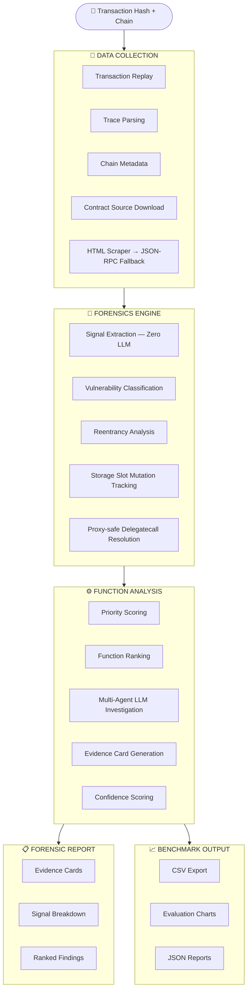

<div align="center">


# ⚡ FaultSeeker++

### AI-Powered Blockchain Transaction Forensics & Vulnerability Localization

[](https://python.org)
[](LICENSE)
[](#-supported-networks)
[](#-benchmark--evaluation)
[](#-development)
[](.)

<br/>

> **FaultSeeker++** replays exploit transactions, reconstructs execution traces, extracts deterministic security signals, ranks suspicious functions, and generates benchmark-ready forensic outputs — all in a single unified pipeline.

*Built for security researchers, auditors, and academics working on smart contract vulnerability analysis.*

---

[**Quick Start**](#-getting-started) · [**Architecture**](#-architecture) · [**Networks**](#-supported-networks) · [**Benchmark**](#-benchmark--evaluation) · [**Citation**](#-citation)

</div>

---

## Why FaultSeeker++?

Most exploit analysis tools stop at detection. FaultSeeker++ goes further — from raw transaction hash to a fully structured, ranked, and explainable forensic report.

| Capability | What it means |
|---|---|
| 🔀 **Dual-path data collection** | HTML scraping with automatic JSON-RPC fallback when block explorers are WAF-protected. No chain gets left behind. |
| 🧠 **Hybrid model routing** | Simple tasks stay on local models; heavy reasoning escalates to cloud providers. You control API spend. |
| 🧑‍💻 **Human-in-the-loop checkpoints** | The analyst stays in the loop at critical decision points — no blind trust in model output. |
| 📊 **Structured evidence** | Every finding includes signal breakdowns, confidence scores, and priority rankings — not just a boolean "vulnerable." |
| 🌐 **10-chain coverage** | Ethereum, BSC, Polygon, Arbitrum, Optimism, Avalanche, Base, Fantom, Gnosis, and zkSync. All validated. |
| 🧪 **Reproducible benchmarks** | 246 real exploit transactions with ground-truth labels, evaluation harnesses, and CSV export. |

---

## 🏗 Architecture



---

## 📦 Pipeline Output

FaultSeeker++ emits **structured forensic data** at the transaction level, ready for analyst triage, benchmark scoring, dataset generation, and downstream model training.

```json
{
    "reentrancy": {
        "score": 0.675,
        "detected": true,
        "tier": "POSSIBLE_REENTRANCY",
        "signals": {
            "cross_function_reentry": true,
            "reentry_before_return": true,
            "state_slot_reentry": false
        }
    },
    "priority": {
        "total": 0.8754,
        "exploitability": 0.75,
        "reentrancy": 0.459,
        "flashloan": 0.0,
        "price_manipulation": 0.0,
        "liquidity_drain": 0.081,
        "reentrancy_source": "fallback"
    }
}
```

---

## 🌐 Supported Networks

| Chain | Explorer | Data Source | Status |
|---|---|---|:---:|
| **Ethereum** | etherscan.io | HTML + RPC | ✅ |
| **BSC** | bscscan.com | HTML | ✅ |
| **Polygon** | polygonscan.com | HTML + RPC | ✅ |
| **Arbitrum** | arbiscan.io | HTML | ✅ |
| **Optimism** | optimistic.etherscan.io | HTML | ✅ |
| **Avalanche** | snowtrace.io | RPC fallback | ✅ |
| **Base** | basescan.org | HTML | ✅ |
| **Fantom** | ftmscan.com | RPC fallback | ✅ |
| **Gnosis** | gnosisscan.io | RPC fallback | ✅ |
| **zkSync Era** | explorer.zksync.io | RPC fallback | ✅ |

> The dual-path architecture ensures every chain works reliably. When a block explorer blocks automated requests (Cloudflare WAF), the system falls back to direct JSON-RPC calls — `eth_getTransactionByHash`, `eth_getTransactionReceipt`, and `eth_getCode`.

---

## 🚀 Getting Started

### Requirements

- Python **3.10+**
- [Foundry](https://getfoundry.sh/) `cast` on `PATH` *(most reliable replay path)*
- At least **one** cloud LLM API key for full analysis flows
- A **trace-capable archive RPC** for production-quality replay

### Install

```bash
pip install -r requirements.txt
```

### Configure

```bash
cp .env.example .env
```

Fill in what you need. **Minimum:** one LLM key + one trace-capable RPC for the target chain.

```bash
# ── LLM providers (at least one required) ───────────────────────
OPENAI_API_KEY=sk-...
GOOGLE_API_KEY=AIza...
ANTHROPIC_API_KEY=sk-ant-...
XAI_API_KEY=xai-...

# ── Explorer APIs (optional, for verified source download) ───────
ETHERSCAN_API_KEY=
BSCSCAN_API_KEY=

# ── Trace-capable RPCs (Tenderly free tier recommended for ETH) ──
TENDERLY_ACCESS_KEY=YOUR_TENDERLY_ACCESS_KEY_HERE
ETH_RPC_URL=https://rpc.ankr.com/eth/YOUR_ANKR_KEY
BSC_RPC_URL=https://rpc.ankr.com/bsc/YOUR_ANKR_KEY
```

> **Note:** `debug_traceTransaction` is not available on most free RPC endpoints. For Ethereum, [Tenderly](https://tenderly.co) provides the most reliable trace access. Foundry replay works when RPC trace methods are restricted.

---

## 🔍 Analyze a Transaction

```bash
# Basic analysis
python -m faultseeker -txn_hash 0xYOUR_TX_HASH -chain eth

# With explainability output
python -m faultseeker -txn_hash 0xYOUR_TX_HASH -chain eth --explain

# Using a block explorer link directly
python -m faultseeker -txn_link https://etherscan.io/tx/0xYOUR_TX_HASH
```

---

## 🧪 Benchmark & Evaluation

### Dataset

**246 real exploit transactions** across 10 EVM chains (2021–2026), with **80+ vulnerability labels** sourced from postmortems, incident writeups, and exploit repositories.

```bash
# Validate the benchmark dataset
python benchmark/validate_dataset.py
```

### End-to-End Evaluation

```bash
python run_benchmark_eval.py --limit 5
python run_benchmark_eval.py --chains eth arbitrum base --limit 10
python run_benchmark_eval.py --full
```

Results land in `reports/eval/` as JSON, CSV, and summary text files.

### Signal-Focused Evaluation

```bash
python benchmark/run_eval.py --chain eth --limit 20 --save
python benchmark/run_eval.py --signals-only --limit 50
```

---

## 🛡️ Reentrancy Engine

The reentrancy detector goes beyond simple repeated-address checks:

| Feature | Description |
|---|---|
| 🗄️ **Storage-backed detection** | Tracks `SSTORE` operations per contract; flags write-after-external-call patterns |
| 🔄 **Fallback mode** | Structural analysis when storage traces are unavailable (public RPCs) |
| 🔒 **Proxy-safe** | Normalizes delegatecall chains before analysis |
| 🔀 **Cross-function support** | Detects reentry across different function selectors |
| 📊 **Tiered output** | `CONFIRMED` · `POSSIBLE_REENTRANCY` · `WEAK_SIGNAL` · `NONE` — with explainable signals |

---

## 🤖 Model Providers

Hybrid routing keeps costs low: simple classification stays local, deep reasoning escalates to cloud.

| Provider | Tier | Use Case |
|---|---|---|
| **Ollama** *(local)* | Local | Quick classification, low-stakes analysis |
| **OpenAI** | Cloud | Deep function investigation, complex reasoning |
| **Google Gemini** | Cloud | Alternative cloud path |
| **Anthropic Claude** | Cloud | Function analysis, code review |
| **Alibaba Qwen** *(DashScope)* | Cloud | Alternative cloud path |
| **xAI Grok** | Cloud | Alternative cloud path |

---

## 🗂 Repository Layout

```
faultseeker/
├── core/               # Pipeline orchestration, routing, confidence scoring
├── data_collection/    # Replay, trace parsing, transaction metadata, contract download
├── forensics/          # Signal extraction, classification, forensic result schemas
├── function_analysis/  # Function ranking and multi-agent investigation
├── prompts/            # Model prompts and task templates
└── utils/              # RPC, explorer, parser, and agent utilities

benchmark/              # Benchmark CSV, validation, signal evaluation harness
tests/                  # 111 regression and integration tests
paper/                  # Implementation paper skeleton
reports/                # Generated evaluation outputs
data/output/            # Single-run analysis artifacts
```

---

## 🛠 Development

```bash
# Full test suite (111 tests)
python -m pytest tests -q

# Specific test modules
python -m pytest tests/test_reentrancy_state_signals.py -q
python -m pytest tests/test_pipeline_parse.py -q

# Multi-chain data collection validation
python test_chains.py

# Cross-chain batch analysis
python -m faultseeker.core.cross_chain_runner --limit 5 --chains eth bsc arbitrum

# Generate evaluation charts
python generate_charts.py
```
---

## 📄 License

Released under the **[MIT License](LICENSE)**.

---

<div align="center">

**Built with precision for the blockchain security community.**

*FaultSeeker++ — From transaction hash to forensic truth.*

</div>
